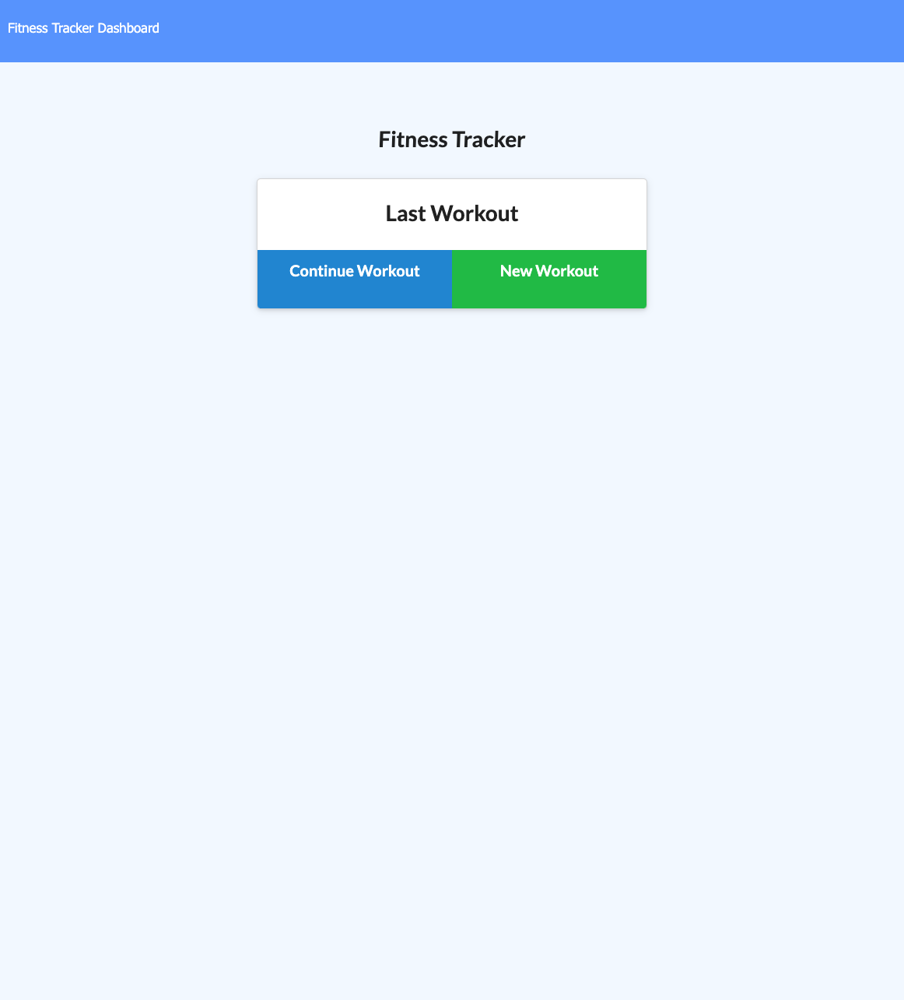

# NoSql Fitness Tracker

## Description 
The goal of this assignment was to create a workout tracker using a Mongo database with a Mongoose scheme and handle routes with Express. I was given starter code for the front end, but had to create the routes to get, post, put and delete to/from the NoSql database.

## User Story
"As a user, I want to be able to view create and track daily workouts. I want to be able to log multiple exercises in a workout on a given day. I should also be able to track the name, type, weight, sets, reps, and duration of exercise. If the exercise is a cardio exercise, I should be able to track my distance traveled."  

## Acceptance Criteria
When the user loads the page, they should be given the option to create a new workout or continue with their last workout.

The user should be able to:

  * Add exercises to the most recent workout plan.

  * Add new exercises to a new workout plan.

  * View the combined weight of multiple exercises from the past seven workouts on the `stats` page.

  * View the total duration of each workout from the past seven workouts on the `stats` page.

## Usage
Below is an image of the application home page: 

## Conclusion
I found this assignment to be quite challenging! Even though I was given plenty of starter code, most of it was for the front-end, and I had a difficult time developing the necessary routes to get this application fully functioning. That being said, I do feel that this was the first assignment where I had a stronger understanding of how each line of code in my server.js file impacted the overall goals of the application. I definitely plan to come back to this assignment and review what's working (and why), as well as find solutions for what's not working :) 